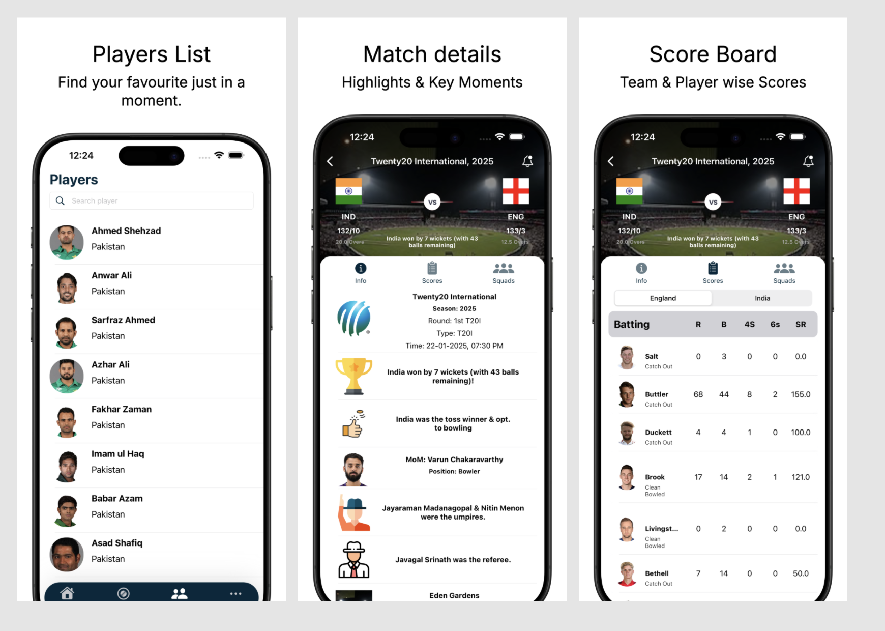

# Cricthusiast

Cricthusiast is a feature-rich cricket app designed for the dedicated cricket fan. It offers real-time updates, comprehensive statistics, and engaging content to bring the thrill of the cricket world to your fingertips. With functionalities reminiscent of popular platforms like Cricbuzz, it provides everything you need to stay connected with the sport.

## Features

- **Real-Time Live Scores and Commentary**
  - Fetch live match scores, ball-by-ball commentary, and in-depth analysis.

- **Detailed Match Information**
  - Access complete details of ongoing, past, and upcoming matches including team line-ups, playing conditions, and full scorecards.

- **Player and Team Statistics**
  - Explore player profiles, career stats, and team performance records with dynamic leaderboards and rankings.

- **Match Schedules and Notifications**
  - Stay informed with upcoming fixtures and personalized notifications.

- **World Rankings and Records**
  - View ICC team and player rankings for all cricket formats, with record-breaking performance updates.

- **Country and Team Insights**
  - Get comprehensive details for your favorite teams, including player rosters and strategic insights.

- **Advanced Search Functionality**
  - Use filters to search for upcoming matches by date range or team.

- **Player Career Histories**
  - Access full career statistics and historic achievements of players.

- **User notifications before any match starts**
  - Engage & alert users through notification before any match starts.

- **Core Data Caching**
  - Enjoy swift access to content with core data caching for uninterrupted viewing.

- **Cricket News and Highlights**
  - Watch and share breaking cricket news and post-match highlights.

- **Interactive News Viewing**
  - Read detailed articles using integrated WebKit-powered WebView.

- **Bookmarking and Content Management**
  - Bookmark your favorite articles for easy access and manage your content preferences.

- **Live Updates and Auto Refresh**
  - Use pull-to-refresh or auto-refresh options to get the latest information.

- **Efficient Pagination**
  - Navigate through match data with smooth, paginated loading.

- **Responsive Alert System**
  - Receive real-time alerts for connectivity issues and other key scenarios.

